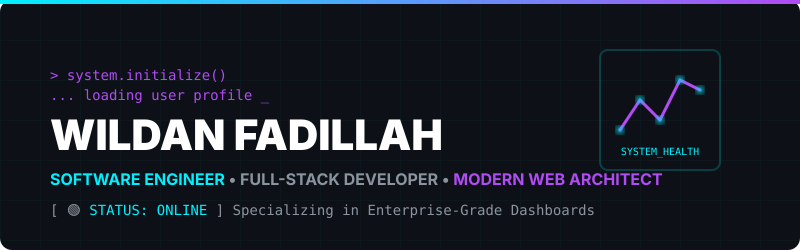
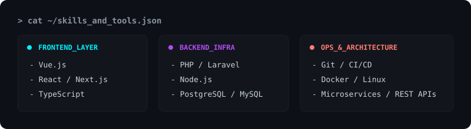

  

 

  

 

  <table>
    <tr>
      <td align="center" width="50%" style="border: none; background: transparent;">
        
      </td>
      <td align="center" width="50%" style="border: none; background: transparent;">
        
      </td>
    </tr>
  </table>

 

  <h3 style="color: #00F0FF; font-family: monospace;">&gt; CONTRIBUTION_GRID</h3>
  <picture>
    <source media="(prefers-color-scheme: dark)" srcset="https://raw.githubusercontent.com/WildanFadillah1512/WildanFadillah1512/output/dist/github-contribution-grid-snake-dark.svg">
    <source media="(prefers-color-scheme: light)" srcset="https://raw.githubusercontent.com/WildanFadillah1512/WildanFadillah1512/output/dist/github-contribution-grid-snake.svg">
    
  </picture>

 

  <h3 style="color: #B14BF4; font-family: monospace;">&gt; ESTABLISH_CONNECTION</h3>
   
  
  

