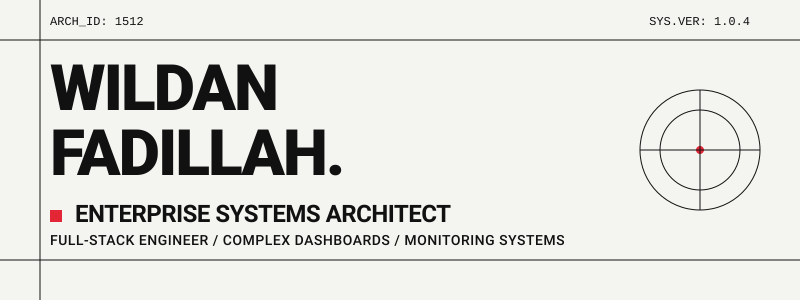
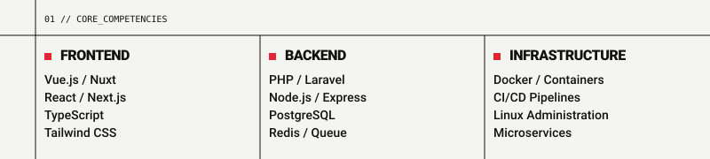

  

  

 

  <table>
    <tr>
      <td align="left" width="50%" style="border: none; background: transparent; padding: 0;">
        
      </td>
      <td align="left" width="50%" style="border: none; background: transparent; padding: 0;">
        
      </td>
    </tr>
  </table>

 

  
02 // CONTRIBUTION_GRID

  <picture>
    <source media="(prefers-color-scheme: dark)" srcset="https://raw.githubusercontent.com/WildanFadillah1512/WildanFadillah1512/output/dist/github-contribution-grid-snake-dark.svg">
    <source media="(prefers-color-scheme: light)" srcset="https://raw.githubusercontent.com/WildanFadillah1512/WildanFadillah1512/output/dist/github-contribution-grid-snake.svg">
    
  </picture>

 

  
03 // ESTABLISH_CONNECTION

  
  

